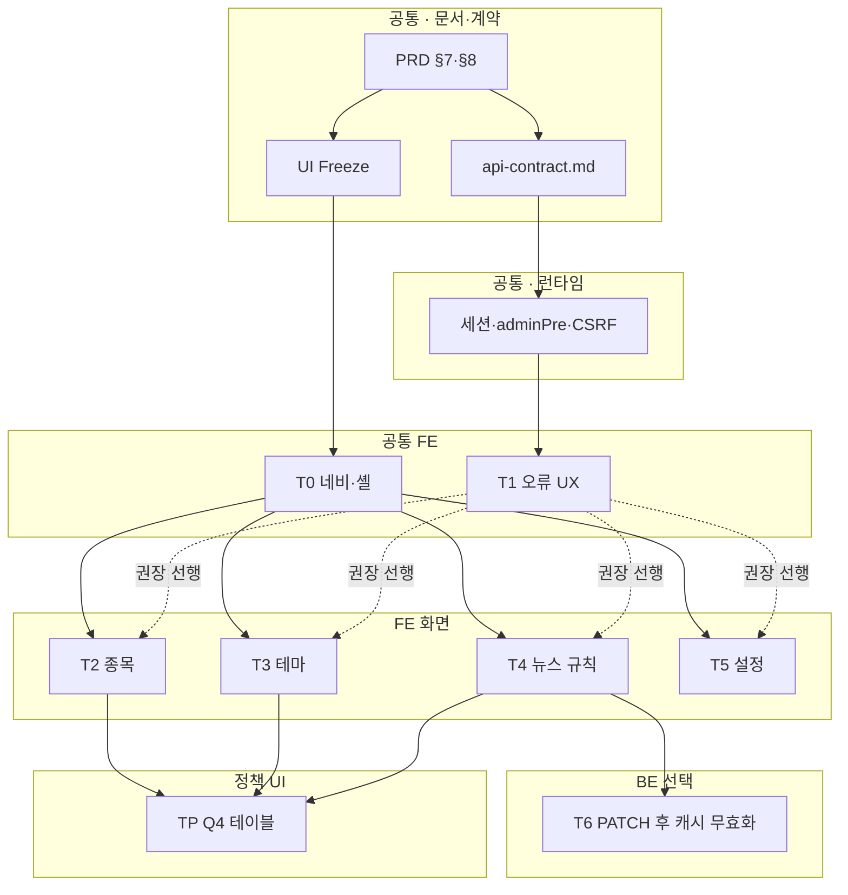

# 설정 UI — 분할 구현 계획

**UI 고정:** [`settings-ui-freeze.md`](./settings-ui-freeze.md)  
**PRD:** [`settings-ui-prd.md`](./settings-ui-prd.md)  
**계약·운영:** [`settings-ui/api-contract.md`](./settings-ui/api-contract.md) · [`settings-ui/operations.md`](./settings-ui/operations.md)

## 역할 (AGENTS.md)

| 역할 | 사용 이유 |
|------|-----------|
| **frontend-agent** | 네비·각 `page.tsx`·`globals.css`·오류 UI·반응형·다크모드 |
| **backend-agent** | API 동작 변경이 필요할 때만(예: 뉴스 규칙 PATCH 캐시 무효화) |
| **qa-agent** | 트랙 완료 후 [`settings-ui/qa-checklist.md`](./settings-ui/qa-checklist.md) |
| **docs-agent** | Freeze·본 계획·PRD 상호 링크 유지(선택) |

## 프론트·백엔드·공통 의존관계

**요약:** **공통(계약·인증·오류 스펙)**이 가장 아래층이며, 그 위에 **공통 FE(셸·네비·오류 UX)**, 그다음 **화면별 FE**가 올라간다. **백엔드 변경(T6)**은 선택이며, 없어도 기존 API로 화면 구현은 가능하고(캐시 일관성만 PRD §7.3과 별도 판단), 있으면 **계약·동작 문서**를 먼저 고정한 뒤 배포 순서를 정한다.

### 층별 선행·후행

| 층 | 산출물·작업 | 선행(반드시 먼저) | 후행·병렬 |
|----|-------------|-------------------|-----------|
| **공통(문서·계약)** | PRD §7·§8, [`settings-ui/api-contract.md`](./settings-ui/api-contract.md), [`settings-ui-freeze.md`](./settings-ui-freeze.md) | 제품 정책 합의 | 모든 FE·BE 트랙의 판단 기준 |
| **공통(런타임·보안)** | 세션 쿠키, `adminPre`/`requireAuth`, CSRF·Bearer 예외(운영: [`settings-ui/operations.md`](./settings-ui/operations.md)) | API 서버·환경 변수 | 비GET을 호출하는 모든 설정 UI FE |
| **공통 FE** | **T0** 네비·IA, **T1** 오류 메시지 매핑(`error.message`/`code`, 네트워크 분리) | 공통 계약 이해 | **T2~T5**(T0 후 병렬 가능); T1은 T2 전 **완료 권장**(아니면 페이지별 임시 헬퍼 → T1에서 통합) |
| **FE 화면** | **T2~T5** 각 `page.tsx` | **T0** | 서로 **파일 분리**로 T0 머지 후 **병렬** |
| **BE(선택)** | **T6** `news-rules` PATCH 후 캐시 무효화 | T4에서 PATCH 사용 경로 확인(재현 시나리오) | **api-contract.md**·PRD §7.3 문구 동기화; FE 계약 필드 변경 없으면 **FE 재작업 불필요** |
| **공통(정책 UI)** | **TP** Q4 페이지네이션 | PRD Q4 확정 + 해당 목록 화면(T2~T4) 존재 | 규칙 적용 또는 면제 문서화 |

### 의존 그래프 (논리 순서)

- **점선:** 권장 순서(병렬로 시작해도 되나, 중복 매핑을 줄이려면 T1 선완료).
- **T6:** `T4 --> T6`는 “뉴스 규칙 PATCH가 실제로 쓰이는 흐름이 정리된 뒤” 백엔드 보강을 의미한다. T6 없이도 T4 UI·API 호출은 동작한다.

### 통합·검증 시 의존관계

| 확인 항목 | 필요 층 |
|-----------|---------|
| 로그인 후 설정 메뉴 노출 | 공통 런타임 + **T0** |
| 쓰기(POST/PATCH/PUT/DELETE) 성공/409/403 표시 | 공통 런타임 + **T1** + 해당 **T2~T5** |
| 규칙 수정 직후 뉴스 반영 일관성 | **T4** + (선택) **T6** |
| Gate 3 / QA 체크리스트 | 위 완료 + [`settings-ui/qa-checklist.md`](./settings-ui/qa-checklist.md) |

### 파일·PR 관점 (충돌 방지)

| 동시 작업 | 의존·주의 |
|-----------|-----------|
| T2∥T3∥T4∥T5 | **T0** 머지 후; 서로 다른 `page.tsx` — 충돌 낮음 |
| T6 ∥ T4 | **동일 PR**이면 `news-rules.ts` vs `news-rules/page.tsx` 충돌 가능 → **T6은 별도 PR** 또는 T4 머지 후 T6 권장 |
| T1 ∥ T2~T5 | 공용 모듈(`api-client`, `lib/admin-error.ts` 등)을 건드리면 **rebase 순서** 조율 |

## Gate 2 (병렬) 적용 여부

- **API 계약:** 관리 CRUD는 이미 존재 → **신규 엔드포인트 없이** UI만 맞추면 **프론트 단일 트랙**으로도 가능.
- **백엔드 소규모 수정**(캐시 등)이 들어가면, 계약 변경 시 `api-contract.md`·PRD §8 동기화 후 **짧은 백 트랙**을 순차 또는 소규모 병렬로 둔다.

---

## 트랙 개요 (권장 순서)

| ID | 범위 | 주요 파일·영역 | 의존 | 완료 기준 (요약) |
|----|------|----------------|------|------------------|
| **T0** | 네비·IA 고정 | `AdminNav.tsx`, (필요 시) `layout.tsx` | 없음 | Freeze §1: **설정** 메뉴 추가, 문의는 보조 배치 |
| **T1** | 공통 오류 UX | `api-client` 또는 각 설정 페이지 공통 헬퍼 | T0 선택 | PRD §7.5 — `error.message` / `code` 우선 표시, 네트워크 분리 |
| **T2** | 종목 | `settings/stocks/page.tsx` | T0 | 요약·폼·표·상태·409/502 안내 |
| **T3** | 테마 | `settings/themes/page.tsx` | T0 | 동일 패턴 |
| **T4** | 뉴스 규칙 | `settings/news-rules/page.tsx` | T0 | GLOBAL/STOCK 오류 표시 |
| **T5** | 설정 | `settings/settings/page.tsx` | T0 | 동일 패턴 |
| **T6** | API(선택) | `news-rules.ts` — PATCH 후 `newsCache.invalidate` | T4와 정합 | 규칙 수정 직후 뉴스 반영 일관성 |
| **TP** | 테이블 규칙(Q4) | 종목·테마·규칙 목록 화면 | PRD Q4 확정 | `.cursor/rules/30-table-pagination.mdc` 또는 **면제** 문서화 |

---

## 병렬 가능 구간

| 병렬 묶음 | 트랙 | 파일 충돌 주의 |
|-----------|------|----------------|
| **A** | T2, T3, T4, T5 | 각각 다른 `page.tsx` — **동시 작업 가능**(T0 머지 후). |
| **B** | T6 | `news-rules.ts`만 — **T4와 같은 PR이면 순차**, 별도 PR이면 T4 머지 후 T6 권장. |
| **C** | T1 | `api-client.ts` 또는 `lib/admin-error.ts` 신설 시 — **T2~T5 시작 전** 또는 **각 페이지에 로컬 헬퍼 후 T1에서 통합** 중 택일. |

**통합 Owner:** 한 명이 T0→T1 순서와 T2~T5 PR 순서를 조율하면 충돌 최소화.

---

## 권장 일정(예시)

1. **Sprint 1:** T0 완료 → T1 착수 + T2~T5 중 1~2화면 병렬  
2. **Sprint 2:** 나머지 화면 + T6(필요 시)  
3. **Sprint 3(선택):** TP — Q4 결정 후만

---

## DoD (트랙 공통)

- [`settings-ui-freeze.md`](./settings-ui-freeze.md) 위반 없음(또는 Freeze 개정 반영).
- [`settings-ui/qa-checklist.md`](./settings-ui/qa-checklist.md) 해당 항목 통과.
- PRD §7 주요 코드 경로에 대한 **사용자 메시지** 존재.

---

## 개정 이력

| 일자 | 요약 |
|------|------|
| 2026-05-10 | 최초 — UI Freeze 연동, T0~TP·병렬·Gate 2 메모 |
| 2026-05-10 | 프론트·백엔드·공통 의존관계(표·Mermaid·통합·PR) 추가 |
